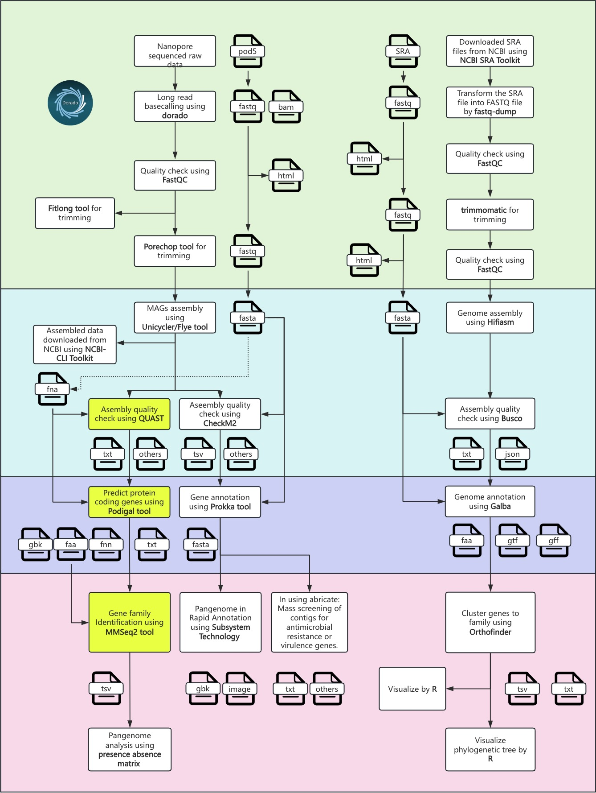

## Introduction to Microbiome Pipeline Tools
This pipeline employs three key tools — QUAST, Prodigal, and MMSeq2 — for evaluating genome assembly quality, predicting gene sequences, and clustering gene families. These steps are essential in genome/microbiome studies, especially for accurate assembly assessment, gene identification, and comparative analysis across genomes.

## Dependencies & Version Information
Ensure the following dependencies are installed to run the pipeline:

- **QUAST**: v5.0.2
- **Prodigal**: V2.6.3
- **MMSeqs2**: 13.45111
- **Additional Python Packages**: biopython 1.84, numpy 1.26.4, pandas 2.2.2, xlrd 2.0.1, openpyxl 3.1.5

## Environment Setup
Load Anaconda3 on ARC to create a conda environment and activate it before running each tool:

    module load Anaconda3
    conda create -n <env name>
    source activate <env name>

After creating and activating the environment, install each tool using conda.

## Data download

To download genomic data, install the **NCBI CLI tool** using Conda

```
datasets download genome accession GCA_041080895.1 --output-dir/path/to/save
```

**Note**: Use the following command to download the provided genome assemblies. The “datasets” CLI tool can be used for downloading the data when the assembly accessions are provided. The command script is in "01_data_download.sh", and the list of genomes is specified in "complete_genome_list.txt".

## 1. QUAST Analysis (Quality Assessment of Genome Assemblies)

### 1.1 Introduction
[QUAST](https://bioinf.spbau.ru/quast) assesses the quality of genome assemblies by analyzing contigs for metrics like N50, L50, and total contig length. This provides insights into the completeness and accuracy of microbial genome assemblies, a key step before further analysis.

### 1.2 Installation
To install QUAST on ARC:

    conda install -c bioconda quast

After installation, user can verify the version:

    quast --version

### 1.3 Running QUAST
QUAST accepts assembly files and outputs detailed reports on genome quality:

    quast /path/to /downloaded_assembled_data/*.fna -o quast_output

**Note**: If a user needs to run QUAST on multiple .fna files (all starting with "GCA"), you can automate this in the script. After saving the script, make it executable by running. Refer to this bash script as “02a_quastScript.sh”

### 1.4 Accumulate all the reports of the QUAST results to a single directory using a bash script

Refer this bash script for accumulation of .txt files from QUAST output in separate folder 

"02b_quastAccumulation.sh"

### 1.5 Input Requirements
- **Input Format**: FASTA files of genome assemblies, with a minimum contig length threshold specified to filter out short contigs.
- **Input Location**: Store assembly files in a dedicated directory, such as assembly_data/

### 1.6 Output Explanation
- Reports:
    - N50 and L50: Metrics for assembly contiguity.
    - Total Contig Length: The total length of all contigs.
    - GC Content: An indicator of the genomic composition.
- Files Generated:
    - report.txt: Summary report of all assemblies.
    - contigs_reports: Folder with detailed contig-based metrics.

**GitHub Link**

For more information, visit the [QUAST GitHub page](https://github.com/ablab/quast).

## 2. Prodigal Analysis (Gene Prediction and Annotation)

### 2.1 Introduction

PRODIGAL predicts protein-coding genes within prokaryotic genomes, identifying open reading frames and translating initiation sites. This is critical for annotating microbial genomes and inferring gene functions.

### 2.2 Installation
To install Prodigal on ARC:

    conda install -c bioconda prodigal

Verify installation with:

    prodigal -v

### 2.3 Running Prodigal
Run Prodigal on each genome assembly to predict genes:

    prodigal -i genome.fasta -a genes.faa -d genes.ffn -o output.gbk -s scores.txt

**Note**: User can create and run the bash script for analyzing your multiple .fna files, make the script executable and run it. Refer this bash script as "03a_prodigalScript.sh"

### 2.4 Input Requirements
- Input Format: Genomic FASTA files from which genes are to be predicted.
- Input Location: Place all input genomes in a directory, e.g., genome_data/.

### 2.5 Output Explanation
- Output Files:
    - .gbk file: Contains gene prediction results in GenBank format.
    - .faa file: FASTA file of predicted protein sequences.
    - .ffn file: FASTA file of predicted nucleotide sequences of genes.
    - .txt file: Score file with translation tables and gene scores.

**GitHub Link**

For more details, refer to the [Prodigal GitHub page](https://github.com/hyattpd/Prodigal).

## 3. MMSeq2 Analysis (Clustering of Protein Sequences)

### 3.1 Introduction
MMSeqs2 performs many-against-many sequence comparisons and clusters sequences based on similarity. This tool is used to create clusters of homologous gene families across genomes, essential for microbial comparative studies.

### 3.2 Installation
To install MMSeqs2 on ARC:

    conda install -c bioconda mmseqs2

Verify installation:

    mmseqs --version

### 3.3 Running MMSeq2
#### 3.3.1 Prepare Input Data
You have accumulated all the .faa files from Prodigal analysis under /results/03_prodigal/all_faa_files. These files contain the predicted protein sequences and will be the input for MMseqs2.
- Ensure that your .faa files are in the correct format and named appropriately for each genome. Refer this bash script for accumulation of all .faa files “03b_faaAccumulation.sh”

Modify the header of the FASTA files to shorten them and change the ID to just the sequence of the genome. For example, a previous header

"CP074663.1_1 # 1 # 1401 # 1 # ID=1_1;partial=10;start_type=Edge;rbs_motif=None;rbs_spacer=None;gc_cont=0.525" will now become "GCA_001756025_CP074663.1_1"
- The first 13 characters of this ID signify the genome name and remaining identify the gene ID. Use the following code to change the header document “03c_clean_faa_files.py”

#### 3.3.2 Create a Database with MMseqs2
MMseqs2 requires the creation of a sequence database. Use the following command to create the database from your .faa files:

    mmseqs createdb /results/03_prodigal/all_faa_files/*.faa /results/mmseqs2_db

- This command will create a database from all the .faa files.

#### 3.3.3 Perform Sequence Clustering with MMseqs2
Now, perform sequence clustering to identify homologous gene families across genomes. Run the following command:

    mmseqs cluster /results/mmseqs2_db /results/mmseqs2_cluster /results/tmp --min-seq-id 0.5 -c 0.8

- --min-seq-id 0.5: Sets a minimum sequence identity threshold of 50% for clustering.
- -c 0.8: Sets a coverage threshold, ensuring that 80% of the sequence is aligned.

#### 3.3.4 Extract Cluster Information
Once clustering is complete, extract the cluster information to analyze gene families:

```
mmseqs createtsv /results/mmseqs2_db /results/mmseqs2_db /results/mmseqs2_cluster /results/mmseqs2_cluster.tsv
```

This will generate a TSV file with the clustering results, showing which genes belong to which gene families.

**Note**: Use the following script to run MMSeq2 analysis "04_mmseqScript.sh"

#### 3.3.5 Generate Presence-Absence Matrix
Now that you have the cluster information, you can compute the genome-gene family presence-absence matrix. This step can be done by parsing the output TSV file and counting the presence of gene families across the genomes.

You can write a Python script to generate this matrix from the mmseqs2_cluster.tsv file. The script will:

- Use the clustering output to create a binary matrix (1 for presence, 0 for absence). Refer the following python script to calculate the MMSeq matrix “04b_mmseq_matrix_construction.py”. Make sure to add the path of your working directory before running the file.

**GitHub Link**

For further reference, see the [MMSeq2 GitHub page](https://github.com/soedinglab/MMseqs2).

## Other information
For your reference, the steps outlined above correspond to specific sections of the overall workflow.
