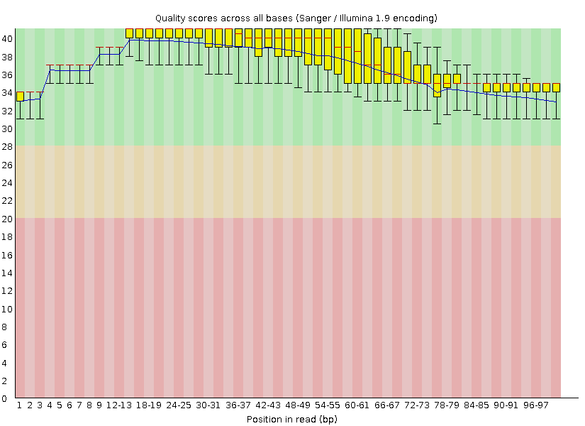

# Introduction
this is the introduction part

### Download raw data and quality check

Download the data by wget or NCBI SRA Toolkit.
Take Rhizoctonia solani AG-1 IA strain:XN Genome sequencing (SRR11560044) for instance, the link of NCBI for this SRA files:
https://trace.ncbi.nlm.nih.gov/Traces/?view=run_browser&acc=SRR11560044&display=data-access

wget:

    wget https://sra-downloadb.be-md.ncbi.nlm.nih.gov/sos5/sra-pub-zq-11/SRR011/560/SRR11560044/SRR11560044.lite.1

NCBI SRA Tooklit:
    
    # activate conda environment and then install the softeware
    conda create -n sra
    conda activate sra
    conda install -c bioconda sra-tools
    # use this command to get the data, it will download to your working directory
    prefetch SRR11560044

Transform the SRA file into FASTQ file by fastq-dump

    # activate conda environment and then install the softeware
    conda install -c bioconda fastqc
    fastq-dump --split-3 SRR11560044
    Quality check by FastQC
    fastqc SRR11560044_1.fastq
    fastqc SRR11560044_2.fastq
The result will be a .html file and will have a picture like this:


### Trimming and Filtering by Trimmomatic
```
# activate conda environment and then install the softeware
conda install -c bioconda trimmomatic
trimmomatic PE SRR11560044_1.fastq SRR11560044_2.fastq output_forward_paired.fastq output_forward_unpaired.fastq output_reverse_paired.fastq output_reverse_unpaired.fastq ILLUMINACLIP:adapters.fa:2:30:10 SLIDINGWINDOW:4:20 MINLEN:36
```
NOTE：

I'm running in "paired-end" mode, meaning I have both forward and reverse reads.

SRR11560044_1.fastq SRR11560044_2.fastq: These are input files (forward and reverse reads).

output_forward_paired.fastq output_forward_unpaired.fastq: These are output files for the forward reads (paired and unpaired).
output_reverse_paired.fastq output_reverse_unpaired.fastq: These are output files for the reverse reads (paired and unpaired).

ILLUMINACLIP.fa:2:30:10: This removes Illumina adapters using the adapter file adapters.fa with specific trimming thresholds.

SLIDINGWINDOW:4:20: This trims low-quality parts of the reads using a sliding window of size 4, trimming when the average quality drops below 20.

MINLEN:36: This removes reads that are shorter than 36 base pairs after trimming.

Quality check by FastQC again
```
fastqc output_forward_paired.fastq
fastqc output_reverse_paired.fastq
```